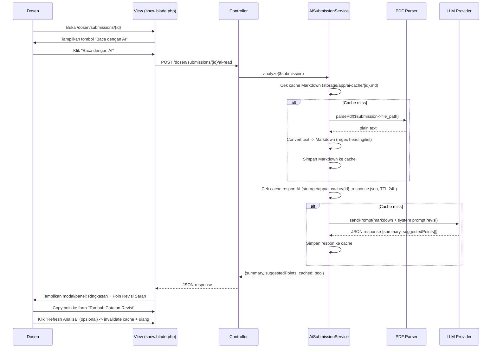

# Design Spec: AI-Assisted Submission Reading for Dosen

**Date:** 2026-08-17  
**Status:** Approved for implementation

---

## 1. Problem Statement

Dosen saat ini harus membuka/unduh file PDF submission mahasiswa, membaca manual, lalu mengetik catatan revisi. Fitur ini memungkinkan dosen klik **"Baca dengan AI"** di halaman detail submission (`/dosen/submissions/{id}`) untuk mendapatkan ringkasan otomatis + saran poin revisi, mempercepat proses pemberian revisi.

---

## 2. Scope & Constraints

| In Scope | Out of Scope |
|----------|--------------|
| Tombol "Baca dengan AI" di halaman show submission dosen | Chat interaktif lanjutan (multi-turn) |
| Konversi PDF -> Markdown via PHP library | Auto-invalidate cache saat file berubah |
| Analisa via LLM lokal (OpenAI-compatible endpoint) | Analisa file attachment revisi |
| Cache Markdown 24h + cache respon AI 24h | Download/preview PDF in-browser |
| Tombol "Refresh Analisa" manual | Notifikasi saat analisa selesai |

**Architecture constraints:**
- Reuse existing `LlmProviderInterface` + `OpenAiCompatibleProvider` dari FR-05 (Asisten Virtual Admin)
- Config via `.env` (`ASSISTANT_LLM_URL`, `ASSISTANT_LLM_API_KEY`, `ASSISTANT_LLM_MODEL`)
- PDF library: `smalot/pdfparser` (Composer, ~5MB)
- Storage: `storage/app/ai-cache/{submission_id}.md` + `storage/app/ai-cache/{submission_id}_response.json`
- Rate limit: pakai throttle existing (`assistant` named throttle di `AssistantServiceProvider`)

---

## 3. User Flow



---

## 4. Components

### 4.1 New Files

| File | Purpose |
|------|---------|
| `app/Services/AiSubmissionService.php` | Orchestrator: PDF parse -> Markdown -> LLM -> cache |
| `app/Http/Controllers/Dosen/AiSubmissionController.php` | Endpoint `POST /dosen/submissions/{submission}/ai-read` + `POST /dosen/submissions/{submission}/ai-read/refresh` |
| `app/Http/Requests/AiReadSubmissionRequest.php` | FormRequest validasi (optional: force_refresh boolean) |
| `resources/views/dosen/submissions/_ai-read-modal.blade.php` | Modal partial: ringkasan + daftar poin saran (Alpine.js) |
| `tests/Feature/DosenAiSubmissionTest.php` | Feature tests |

### 4.2 Modified Files

| File | Change |
|------|--------|
| `routes/web.php` | Tambah 2 route di group `middleware(['auth', 'role:dosen'])` |
| `resources/views/dosen/submissions/show.blade.php` | Tambah tombol "Baca dengan AI" + include modal partial |
| `composer.json` | `require smalot/pdfparser` |
| `.env.example` | Dokumentasi variabel LLM (sudah ada dari FR-05) |

---

## 5. Data Structures

### 5.1 Cache: Markdown File
```
storage/app/ai-cache/
  {submission_id}.md              # Markdown hasil konversi
  {submission_id}_response.json   # Cache respon AI (TTL 24h)
```

**`{submission_id}_response.json`:**
```json
{
  "summary": "Mahasiswa mengusulkan sistem manajemen sidang berbasis web...",
  "suggestedPoints": [
    "Bab 1: Rumusan masalah belum spesifik, perlu dibedakan permasalahan teknis vs bisnis",
    "Bab 3: Metodologi penelitian kurang jelas: tambahkan diagram alur data & justifikasi pilihan algoritma",
    "Bab 4: Hasil uji coba hanya 1 skenario: perlu uji beban, edge case, & perbandingan baseline",
    "Bab 5: Kesimpulan tidak menjawab rumusan masalah poin 2 & 3; saran pengembangan terlalu umum"
  ],
  "generated_at": "2026-08-17T10:30:00Z",
  "model": "llama3.2:latest"
}
```

### 5.2 API Response (Controller -> View)
```json
{
  "success": true,
  "data": {
    "summary": "...",
    "suggestedPoints": [...],
    "cached": true,
    "model": "llama3.2:latest"
  }
}
```

---

## 6. Prompt Engineering (System Prompt untuk Revisi)

```php
// Di AiSubmissionService::buildPrompt(string $markdown): string
<<<PROMPT
Anda adalah asisten dosen pembimbing/penguji sidang Tugas Akhir.
Baca laporan mahasiswa berikut (format Markdown) dan berikan **insight rekomendasi revisi perbaikan** fokus pada **Bab 1, 3, 4, 5**:

1. **Bab 1 (Pendahuluan)**: Kelengkapan latar belakang, rumusan masalah (spesifik & terukur), batasan masalah, tujuan, manfaat, sistematika penulisan.
2. **Bab 3 (Metodologi)**: Kejelasan desain penelitian, alat/bahan, prosedur, teknik pengumpulan data, analisis data, validitas/realibilitas.
3. **Bab 4 (Hasil & Pembahasan)**: Kelengkapan hasil, visualisasi data (tabel/grafik), analisis mendalam, perbandingan dengan teori/penelitian lain, pembahasan keterbatasan.
4. **Bab 5 (Penutup)**: Kesimpulan menjawab SEMUA rumusan masalah, saran spesifik & actionable untuk pengembangan lanjut.

Output HANYA JSON valid:
{
  "summary": "Ringkasan 2-3 kalimat: topik, metode, temuan kunci",
  "suggestedPoints": [
    "Bab 1: ...",
    "Bab 3: ...",
    "Bab 4: ...",
    "Bab 5: ..."
  ]
}
PROMPT;
```

---

## 7. Error Handling

| Scenario | Handling |
|----------|----------|
| Submission tidak punya `file_path` | Return 422: "Belum ada file laporan yang diunggah" |
| File tidak ditemukan di storage | Return 500 + log error |
| PDF parser gagal (corrupt/encrypted) | Return 500: "Gagal membaca file PDF" |
| LLM timeout / error | Return 503: "Layanan AI tidak tersedia, coba lagi nanti" |
| LLM response bukan JSON valid | Fallback: coba parse manual / return error |
| Rate limit exceeded | Return 429 (throttle middleware handle) |

---

## 8. Testing Strategy

| Test | Description |
|------|-------------|
| `test_ai_read_requires_auth` | Guest redirect ke login |
| `test_ai_read_only_for_assigned_dosen` | Dosen non-penguji 403 (policy `view` submission) |
| `test_ai_read_no_file_returns_422` | Submission tanpa file_path |
| `test_ai_read_creates_markdown_cache` | Cache file terbuat di storage |
| `test_ai_read_returns_summary_and_points` | Mock LLM provider, cek response structure |
| `test_ai_read_cache_hit_skips_llm` | Cache response valid -> tidak panggil LLM |
| `test_ai_read_refresh_invalidates_cache` | POST refresh -> hapus cache -> regenerate |
| `test_ai_read_pdf_parse_failure` | Mock parser throw -> 500 response |

---

## 9. Security & Privacy

- **Hanya dosen yang ditugaskan ke schedule submission** bisa akses (policy `view` Submission)
- File PDF **tidak pernah dikirim ke LLM** -- hanya teks Markdown hasil ekstraksi
- Cache disimpan di `storage/app/ai-cache/` (non-public, `FILESYSTEM_DISK=local`)
- LLM endpoint dikonfigurasi via `.env` -- bisa diarahkan ke Ollama/LM Studio lokal (tidak keluar jaringan)

---

## 10. Implementation Order

1. `composer require smalot/pdfparser`
2. Create `AiSubmissionService` (PDF parse -> Markdown -> LLM -> cache)
3. Create `AiSubmissionController` + `AiReadSubmissionRequest`
4. Add routes in `routes/web.php`
5. Add button + modal in `show.blade.php`
6. Write tests
7. Run `php artisan test`, `vendor/bin/pint`, `npm run lint`

---

## 11. Decisions (User Confirmed)

1. **Model**: Pakai `ASSISTANT_LLM_MODEL` existing (endpoint lokal), tapi **prompt berbeda** -- output insight rekomendasi revisi perbaikan fokus ke **Bab 1, 3, 4, 5** (bukan ringkasan umum).
2. **Max tokens**: No limit (kirim full Markdown ke LLM).
3. **Language**: Bahasa Indonesia only.
